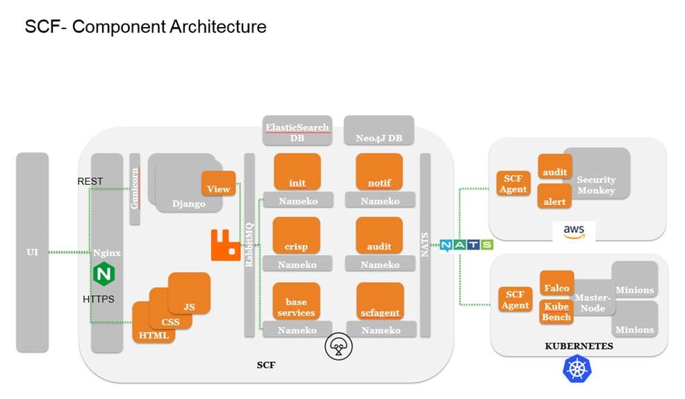

# SCF - Secure Cloud Native Fabric
SCF enables goal-based visibility into changes in security control configurations that implement regulatory compliance requirements as well as organizational security policies so that appropriate action can be taken in real-time. Capabilities enabled by SCF include:   
* Security configuration posture tracking of Kubernetes container orchestrator and multi-cloud infrastructure    
* Tracking real-time compliance—such as CIS, GDPR—posture impacted by security control configuration    
* Application workload behavior posture tracking  

## Functional Architecture

## Compliance Real-time Impact on Securit Posture (CRISP) 
* Define security goals and their relationship with security control configurations in different asset    
* Associate different auditors to monitor security control configurations    
* Real-time impact security analysis on compliance and best practices due to changes in security configurations in different security controls in different assets    
* Determine risk score based on asset importance and criticality of changes    

## Secure Container Runtime Management (SCRM) 
* Management of security group policies, perimeter security policies, container runtime and networking security policies of a container cluster        
* Holistic small-unit visibility and workload identity based zero-trust communication model    

## Installation    

**Prerequisite** SCF currently installs on Ubuntu 16.04.

1) Clone the repository   
2) Run the shell script installer.sh from SCF folder 
    `./installer.sh`
    This will download and install all 3rd party components.
    It will then create the daemons and rin the SCF micro-services
## Accessing the SCF UI
If all goes well, then the SCF UI will be accessible on https://<IP-address>/
Note : The initial commit does not support RBAC, you can used the following default credential to login :
user-name : scf@aricent.com
password : scfadmin

## Use cases   

**1) SD-WAN for Telco**   
* SCF can be used to secure SDN applications forming a SD-WAN network   
* SCF Security Postures can be exported from CI/DI environments to a Production Environment   
* SCF can monitor security-alarms and auto-act on them   
* It can audit Security-Configurations and scan vulnerabilities in Registry Images   

**2) Apply and Monitor Security Posture**   
* SCF can be used to secure a Content Delivery Network (CDN) service hosted by a Telco   
* The Telco can provide CDN as a Service, for popular content.   
* Video and data from the Origin-Server are pulled into the CDN Point-of-Presence servers distributed across the Geographies   
* SCF can secure the end-point security policies and also audit the S3-Storage in a Hybrid Cloud environment   

**3) Mobile Edge Computing (MEC)**   
* SCF would require the Kubernetes API server access-account and credentials as a manifest file from the Cloud Orchestrator   
* SCF would require credentials of the private Docker Repository for setting up Image-Scanning   
* An SCF Agent Application, will be installed on the Kubernetes-Master Host, for setting up secure-communications on a distributed high-performance message-bus with the SCF Server-Application.   
* SCF Agent will use CIS Benchmark rules (configurable) Security Audits. It will enforce Network-Policies using the CNI through the Kube-API Gateway.   

## Tour of SCF   
**1) Goal Driven Security and Compliance with SCF-CRISP**   
    1.1) [Create Security Goals as a Posture in SCF](./documentation/making_postures.md)   
    1.2) [Create Audit Rules for Compliance monitoring](./documentation/create_auditRules.md)   
    1.3) [Monitor with Alarms](./documentation/alarms_monitoring.md)   

**2) Continuous Security with SCF-SCRM**   
    2.1) [View the Cloud Topology as a Social Graph](./documentation/view_topology.md)   
    2.2) [Security across Hybrid Cloud Deployments](./documentation/hybrid_cloud.md)   

## Third party dependencies   
The following third-party libaries have been used in SCF :

| Dependency       | Description          | License  |
| ------------- |:-------------:| -----:|
| `Bootstrap 3` |open-source CSS framework directed at responsive, mobile-first development | MIT |
| `JQuery`      | to simplify HTML DOM tree traversal and manipulation, as well as event handling, CSS animation, and Ajax.| MIT |
| `Font Awesome` | font and icon toolkit based on CSS and LESS.      | MIT |
| `AngularJS` |JavaScript-based open-source front-end web framework helps in developing single-page applications | MIT |
| `D3 JS `    | library for producing dynamic, interactive data visualizations in web browsers | BSD |
| `Yaml Editor` | implementation of YAML, a human-friendly data serialization language | MIT |
| `Contextual Menu` |menu in a graphical user interface that appears upon user interaction | MIT |
| `Footable JS`     | responsive table plugin built on jQuery | MIT |
| `Gauge JS` | plugin for generating and animating nice & clean dashboard gauges | MIT |
| `Charts JS` | Simple, clean and engaging HTML5 based JavaScript charts | MIT |
| `FastClick JS` | library for eliminating the 300ms delay between a physical tap and the firing of a click event on mobile browsers | MIT |
| `Bootbox` | plugin for creating alert, confirm and flexible dialog boxes | MIT |
| `JQV Maps` | plugin that renders Interactive, Clickable Vector Maps | MIT OR GPL-3.0 |
| `JS Tree`  | plugin that provides interactive tree structure | MIT |
| `Flowchart JS` | enables you to create drag'n'drop flowchart boxes and connect between them with a custom line. | MIT |
| `Neo4j Graphs` | graph visualization and analysis platform. It connects directly to Neo4j's graph database technology | MIT |
| `Elastic search` | highly-scalable document storage engine that specializes in search | Apache 2.0 |
| `Python 3` | interpreted, high-level, general-purpose programming language used on a server to create web applications | Python Software Foundation License (PSFL) is a BSD-style, permissive free software license which is compatible with the GNU General Public License (GPL) |
| `Pip 3` | package manager for Python packages, or modules |  |
| `Nginx` | web server which can also be used as a reverse proxy, load balancer, mail proxy and HTTP cache | 2-clause BSD |
| `Nats messaging system` | high performance open source messaging system for cloud native applications, IoT messaging, and microservices architectures | Apache 2.0 |
| `Nameko Microservices` | framework for building microservices in Python | Apache 2.0 |
