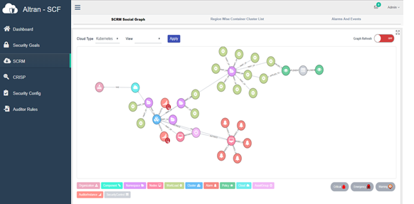

## Monitor with Alarms

1) Compliance Audits can be tailor-made from templates in YAML   
2) Audits can be triggered on Cloud Nodes manually   
3) Continuous Audits can also be configured to monitor run-time behavior
