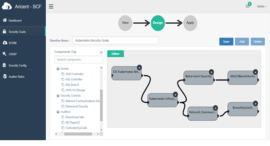

## Create Security Goals as a Posture in SCF

1) Create a Security Posture based on your Security Goals   
2) Map these goals on Asset Groups   
3) Apply Security Controls (Policies) on these Asset Groups   
4) Connect Compliance Audits to the Asset Groups   
5) Save this as a Template for the Security Posture for your Cloud Applications   
