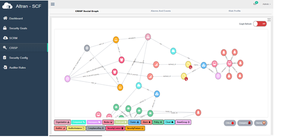

## View the Cloud Topology as a Social Graph

1) We can view the topology of the cloud nodes and deployed workloads, along with security-policies as a Social Graph   
2) It shows a view of deployments and security setup across multiple Hybrid Clouds
